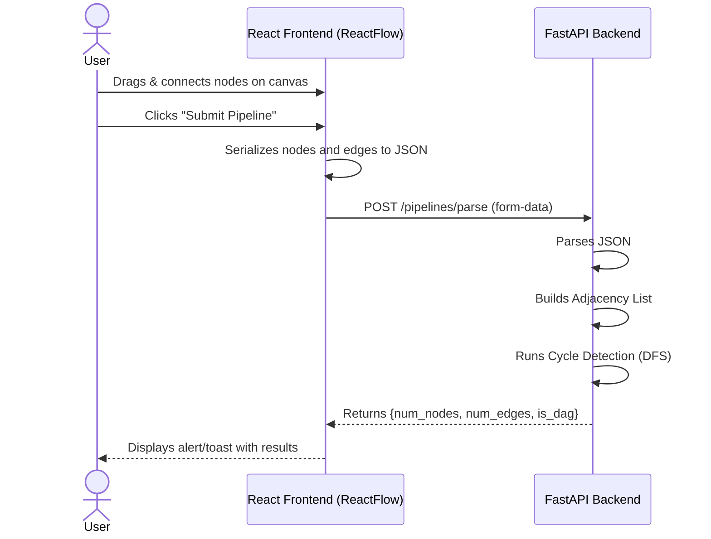

<div align="center">
  
# 🚀 VectorShift Technical Assessment

*An elegant node-based visual pipeline builder with a powerful FastAPI backend.*

[](https://reactjs.org/)
[](https://fastapi.tiangolo.com/)
[](https://reactflow.dev/)
[](https://www.python.org/)

</div>

---

## 🌟 Project Overview

This repository contains a full-stack application designed for building and analyzing visual data pipelines. It consists of a **React-based frontend** leveraging `reactflow` for an intuitive drag-and-drop node interface, and a **FastAPI backend** for parsing and validating the constructed pipelines.

The core objective is to allow users to construct a visual representation of a pipeline and then submit it to the backend to verify if the structure is a valid **Directed Acyclic Graph (DAG)**.

---

## ✨ Features

- **Interactive Canvas**: Drag, drop, and connect nodes to create complex pipelines.
- **Multiple Node Types**: Supports various node types like API Nodes, Condition Nodes, Input Nodes, LLM Nodes, Output Nodes, Text Nodes, Timer Nodes, Transform Nodes, and Webhook Nodes.
- **Real-time Evaluation**: Submit the pipeline to the backend to instantly calculate the number of nodes, edges, and determine if it forms a valid DAG (Directed Acyclic Graph).
- **Aesthetic UI**: Modern, clean, and responsive design for an optimal user experience.
- **RESTful Backend**: A high-performance Python FastAPI backend handling pipeline validation and graph traversal.

---

## 🛠️ Tech Stack

### Frontend
- **React.js** (v18.2.0)
- **React Flow** (v11.8.3) - For node-based UI and edge routing
- **CSS3 / HTML5**

### Backend
- **Python** (3.9+)
- **FastAPI** - High-performance web framework for APIs
- **Uvicorn** - ASGI web server

---

## 🔄 Application Workflow

The following diagram illustrates the data flow between the user interface and the backend processing engine.



### Graph Validation (DAG Checking)
When the backend receives the pipeline data, it performs a **Depth-First Search (DFS)** to detect cycles. If any node leads back to a node currently in the recursion stack, a cycle is detected, meaning the pipeline is **not** a DAG. If no cycles are found, it successfully validates as a DAG.

---

## 🚀 Getting Started

Follow these steps to set up the project locally.

### 1. Clone the Repository
```bash
git clone https://github.com/Harsh-karn/VectorShift-Technical-Assessment.git
cd VectorShift-Technical-Assessment
```

### 2. Backend Setup
Navigate to the backend directory, install dependencies, and start the FastAPI server.
```bash
cd backend

# Create a virtual environment (optional but recommended)
python -m venv venv
source venv/bin/activate  # On Windows use: venv\Scripts\activate

# Install dependencies
pip install fastapi uvicorn

# Start the backend server
uvicorn main:app --reload --port 8000
```
*The backend will run at `http://localhost:8000`*

### 3. Frontend Setup
Open a new terminal, navigate to the frontend directory, install dependencies, and start the React app.
```bash
cd frontend

# Install dependencies
npm install

# Start the frontend application
npm start
```
*The frontend will run at `http://localhost:3000`*

---

## 🔌 API Reference

### Evaluate Pipeline
Evaluates the graph structure to count nodes/edges and check for DAG validity.

**Endpoint:** `POST /pipelines/parse`

**Content-Type:** `multipart/form-data`

**Request Body:**
| Key | Type | Description |
| :--- | :--- | :--- |
| `pipeline` | `string` | A stringified JSON object containing `nodes` and `edges` arrays representing the graph structure. |

**Success Response (200 OK):**
```json
{
  "num_nodes": 5,
  "num_edges": 4,
  "is_dag": true
}
```

---

<div align="center">
  <i>Built with ❤️ for VectorShift</i>
</div>
